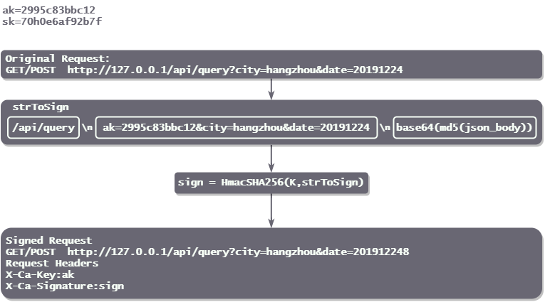

# springboot-api-sign

## API签名demo

**part1：请求端加密**

API使用者会获取到服务器颁发的ak和sk两个秘钥，ak为公钥，sk为私钥。

签名有以下规则：

1. 约定请求时会携带 ak 作为参数并放入 HTTP Header。
2. 请求参数处理：
   - GET：取出所有的参数，并根据 key 进行字典排序，拼装成如下格式。
   - POST：如果是 `application/x-www-form-urlencoded`，直接取出和 GET 参数进行排序拼接，如果是 `application/json`，则直接将整个 json 串 md5 加密后再 base64。

```
GET:
strToSign = uri + "\n" + ak=ak&k1=v1&k2=v2&k3=v3
POST:
strToSign = uri + "\n" + ak=ak&k1=v1Z&k2=v2&k3=v3 + "\n" + base64(md5(json_body))
```

3. 使用 HmacSHA256 算法，传入 sk 进行签名计算，`sign = base64(HmacSHA256(K,strToSign))`。
4. 组装 HTTP 请求，将 `X-Ca-Key=ak,X-Ca-Signature=sign` 添加到 HTTP Header 中进行请求。

一个简单实例如下图所示：

